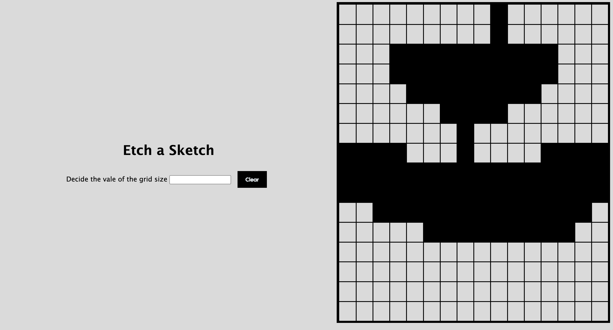

# Etch-a-Sketch (Browser Version)

A simple browser-based Etch-a-Sketch app built with HTML, CSS, and JavaScript.  
Draw by moving your mouse over the grid — just like the classic toy, but digital!

## 🚧 Project Status

The project has been finalized, and its **first stable version (v1.0)** is now complete.  

### Current Phase: Testing & Optimization  
- **Cross-device testing**: Ensuring responsiveness across different screen sizes and devices.  
- **Interactivity checks**: Verifying smooth user interactions and functionality.  

Next steps will include bug fixes (if any) and performance optimizations based on test results. 

## 🖥️ Features (Planned or Implemented)

- Interactive grid for drawing
- Adjustable grid size
- Clear/reset button

## 🛠️ Tech Stack

- HTML
- CSS
- JavaScript

## 📸 Screenshot 

## 📃 License
This project is open-source and available under the MIT License.

